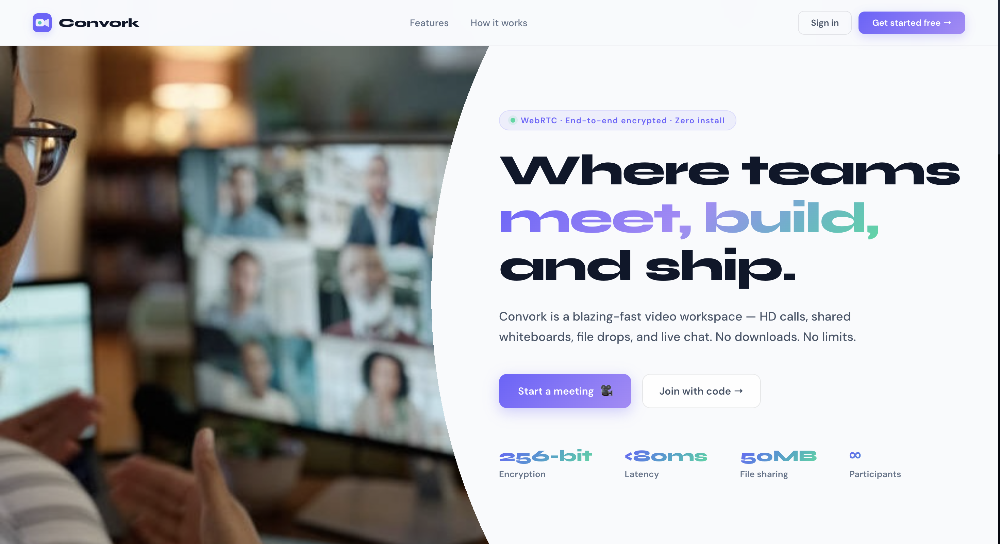
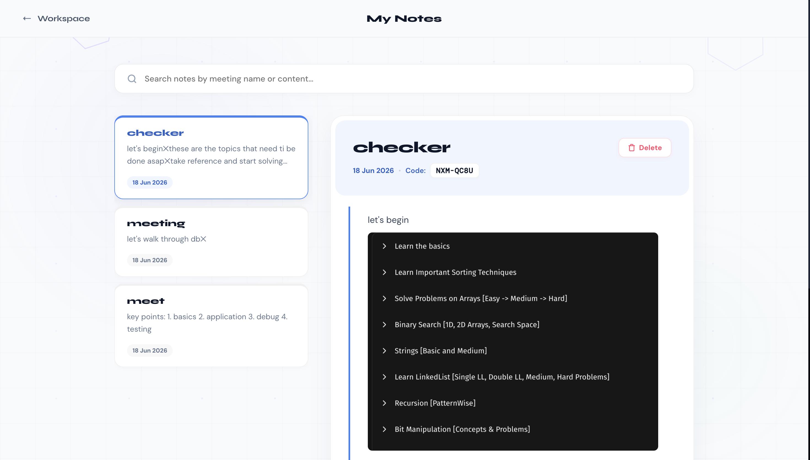
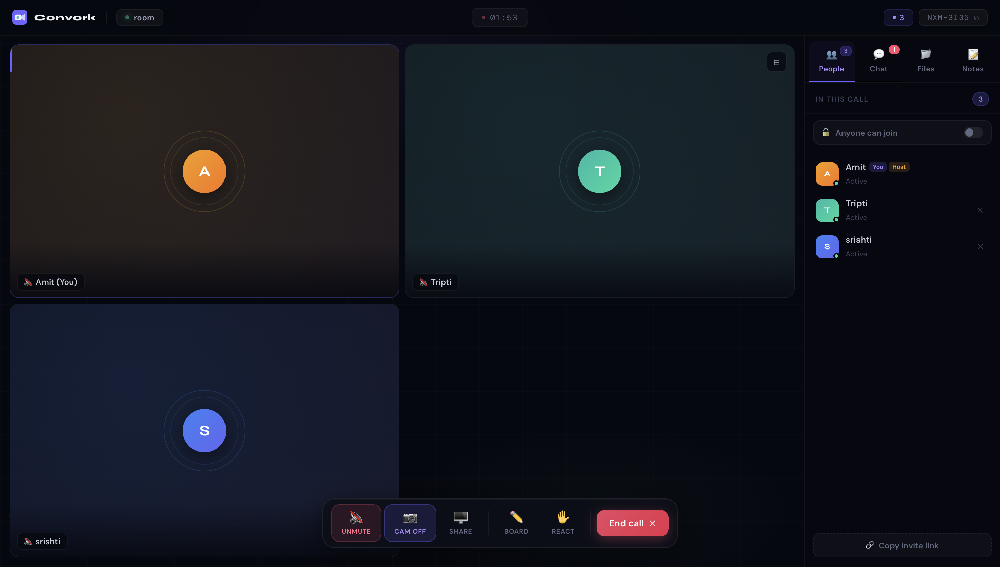

# Convork

A fast, secure video conferencing and collaboration web app — HD video calls, screen sharing, a live whiteboard, file sharing, real-time chat, and private meeting notes with inline screenshots. Built with WebRTC for peer-to-peer media, so your video never touches the server.

<div align="center">

&nbsp;

</div>

---

## ✨ Features

- **HD video calls** — peer-to-peer WebRTC mesh, up to ~6 participants per room
- **Screen sharing** — share your screen or a specific window, with seamless switching back to camera
- **Live whiteboard** — collaborative drawing canvas, synced in real time, auto-opens for everyone when one person starts it
- **Real-time chat** — persists across the call regardless of which sidebar tab is open
- **File sharing** — drag-and-drop uploads, encrypted at rest (AES-256-GCM), up to 50MB per file
- **Private meeting notes** — personal notes per room with autosave, including inline screenshots captured directly from your screen (full screen or drag-to-select an area)
- **Waiting room** — hosts can lock a room and admit/deny participants individually
- **Reactions** — quick emoji reactions during calls
- **TURN server support** — calls work reliably even behind restrictive NATs/firewalls

<div align="center">

</div>

---

## 🛠 Tech Stack

| Layer | Technology |
|---|---|
| Frontend | React + Vite |
| Backend | Node.js + Express |
| Real-time | Socket.io (signaling, chat, whiteboard sync) |
| Video/Audio | WebRTC (via `simple-peer`) |
| Database | PostgreSQL (hosted on Supabase) |
| Auth | JWT + bcrypt |
| File encryption | AES-256-GCM |
| TURN/STUN | Xirsys (or self-hosted coturn) |

---

## 🚀 Getting Started (Local Development)

### Prerequisites
- Node.js 18+
- A Supabase account (free tier works) — or any PostgreSQL database
- A Xirsys account (free tier) for TURN — or self-hosted coturn

### 1. Clone and install

```bash
git clone https://github.com/YOUR_USERNAME/convork.git
cd convork

cd server && npm install
cd ../client && npm install
```

### 2. Set up the database

Create a PostgreSQL database (Supabase recommended), then run the SQL in
`server/config/db.js`'s `initDB()` function — or run:

```bash
cd server
node -e "require('dotenv').config(); require('./config/db').initDB()"
```

### 3. Configure environment variables

```bash
cd server
cp .env.example .env
```

Fill in `.env` with your real values — see comments in `.env.example`
for what each one does and how to generate secrets.

### 4. Run it

```bash
# Terminal 1 — backend
cd server
npm run dev

# Terminal 2 — frontend
cd client
npm run dev
```

Visit `http://localhost:5173`.

---

## 🔒 Security

- Passwords hashed with bcrypt
- JWT-based authentication, 7-day expiry
- Uploaded files encrypted at rest with AES-256-GCM (unique salt + IV per file)
- Rate limiting on auth endpoints (10 attempts/15min) and uploads (20/hour)
- Helmet.js security headers
- Room/file auto-cleanup (rooms expire after 24h, orphaned files purged after 7 days)

---

## 📐 Architecture Notes

**Why mesh, not SFU?** Convork uses peer-to-peer mesh topology, where every
participant connects directly to every other participant. This keeps
latency low and avoids relaying media through a server, which matters for
small meetings (2–6 people) — the typical use case this app is built for.

Mesh doesn't scale well past ~6 participants (bandwidth cost grows with
the square of room size), so larger rooms would need an SFU (Selective
Forwarding Unit) like mediasoup or LiveKit. This isn't implemented, since
it's a significant architectural addition only worth making once you
actually need rooms that large. 

---

## 📄 License

MIT — do whatever you'd like with this.

---

## 🙋 Acknowledgements

Built as a learning project exploring WebRTC, real-time collaboration,
and production-hardening practices (encryption, rate limiting, TURN,
auto-cleanup) for a small-scale video conferencing app.